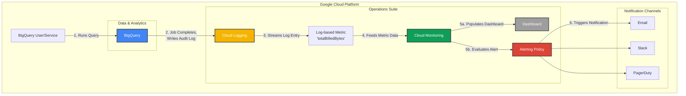

# BigQuery Real-Time Cost Monitoring Architecture

This diagram illustrates the flow of data from a BigQuery job completion to the final notification and visualization, enabling near real-time cost observability.



### Diagram Flow Explained:

1.  **Query Execution:** A user or a service account runs a query in **BigQuery**.
2.  **Audit Log Generation:** As soon as the query job completes, BigQuery writes a detailed audit log to **Cloud Logging**. This log contains the crucial `totalBilledBytes` field.
3.  **Metric Extraction:** The **Log-based Metric** we designed is configured to filter for these specific audit logs and extracts the `totalBilledBytes` value in near real-time.
4.  **Data Aggregation:** The metric data is fed into **Cloud Monitoring**, where it is aggregated and made available for analysis.
5.  **Visualization & Alerting:**
    *   **5a:** The **Dashboard** widgets are populated with this metric data, providing a visual representation of costs.
    *   **5b:** The **Alerting Policy** continuously evaluates the metric against its configured conditions (e.g., a threshold or an anomaly).
6.  **Notification:** If the alerting condition is met, a notification is sent to your chosen **Notification Channels** (like Email, Slack, or PagerDuty), enabling a rapid response.

---

## Automation Script

This repository includes an automation script, [`deploy_monitoring.sh`](deploy_monitoring.sh:1), to deploy the reactive monitoring components of this architecture—including the log-based metric, alerting policy, notification channel, and the monitoring dashboard—using `gcloud` commands.

The dashboard layout is defined declaratively in [`dashboard.json`](dashboard.json:1), allowing you to manage your monitoring infrastructure as code.

### How to Use the Script

1.  **Prerequisites:**
    *   Ensure you have the [Google Cloud SDK](https://cloud.google.com/sdk/docs/install) installed and authenticated (`gcloud auth login`).
    *   Set your target project with `gcloud config set project YOUR_PROJECT_ID`.

2.  **Configure:**
    *   Open the [`deploy_monitoring.sh`](deploy_monitoring.sh:1) file.
    *   Change the `NOTIFICATION_EMAIL` variable at the top of the script to the email address where you want to receive alerts.

3.  **Make Executable:**
    *   From your terminal, run the following command to make the script executable:
        ```sh
        chmod +x deploy_monitoring.sh
        ```

4.  **Run the Script:**
    *   Execute the script from your terminal:
        ```sh
        ./deploy_monitoring.sh
        ```

5.  **Verify Notification Channel:**
    *   The script will create a notification channel for your email. You will receive a verification email from Google Cloud. **You must click the link in this email** to activate the channel and enable alerts.